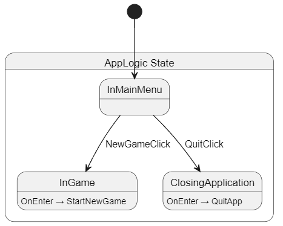
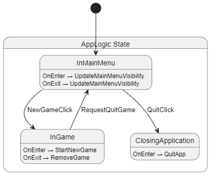
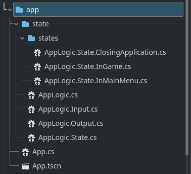
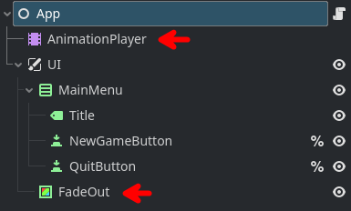
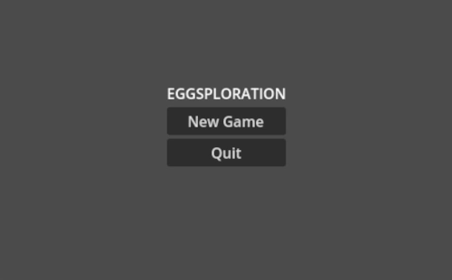
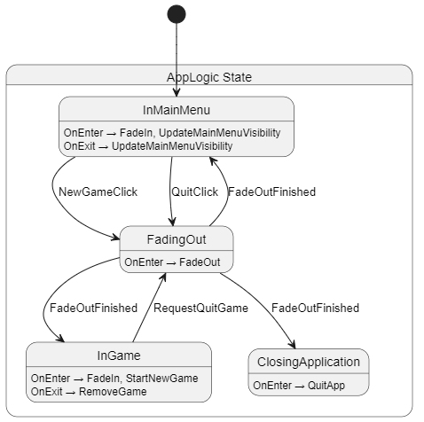

+++
title = "Exploring Chickensoft #2: LogicBlocks"
date = 2025-01-03
description = "Implementing app logic using state machines."
aliases = ["/blog/exploring-chickensoft-2"]


[taxonomies]
tags = ["Godot", "C#", ".NET", "Chickensoft", "fsm", "state machines"]

[extra]
footnote_backlinks = true
quick_navigation_buttons = true
+++

> ⚠️ This post assumes you have a basic understanding of Nodes and Scenes in Godot and at least mid-level familiarity with C# syntax if you plan to code along!

# Introduction

In the last part, we downloaded Godot and setup a project from the Chickensoft GodotGame template. Not terribly riveting, but a good start nonetheless!

In this part, we'll dive straight into implementing game logic that ends up being decoupled from the game engine.

To achieve this, we will start off by using LogicBlocks - a hierarchical state machine package for C# by Chickensoft.

> 🙋🏼 The cool thing about decoupling the game logic from the engine (and LogicBlocks being a general C# package - not a Godot package) means that it makes our game code *vastly easier* to port to other game engines.
> 
> The inner machinations of our game logic and state can live outside of Godot - instead Godot acts as the visual representation of our game.

Prepare for a long ride! 🍫

# Scope

At the end of this post, we will have finished the following steps:

- Implement two major app states, InMainMenu and InGame.
- Reorganize our class files, moving closer to the Chickensoft project structure.
- Add a state to introduce intermediary fade transitions.

The goal is to introduce state machines to our project, aiming to build a solid game architecture that we can easily expand on using Chickensoft tools.

# Implementation

I will start off by shouting from the rooftops **_that [LogicBlocks](https://github.com/chickensoft-games/LogicBlocks) is a really cool package!_**

> 🙋🏼 They're all I dreamed of accomplishing with [my FSM series](/blog/finite-state-machine-1). I could consider myself defeated - but frankly it's more so being ✨ blessed ✨.

With LogicBlocks, we can create complex logic for our game nodes by separating it into different states. Part of the value proposition is that we won't create a tangled mess while doing so. 

> 🙋🏼 Of course, you can still end up with a mess, but it'll be an *idiomatic* mess. That's the most preferable kind of mess, if you ask me!

I remember promising simple beginnings, so we **will** be keeping it simple! This means that the LogicBlock usage might seem overkill, but I'll try my best at explaining why we should bother at all.

## Installing LogicBlocks

The packages need to be added to our project. The LogicBlock docs recommends including the introspection and diagram generator for added convenience and to get automatically generated diagrams for your state machines (we'll take a look at that later).

To include the packages in the right spot in our project file, I'll use good old-fashioned copypasting:

```xml
 <ItemGroup>
    <!-- Production dependencies go here! -->
    <PackageReference Include="Chickensoft.LogicBlocks" Version="5.13.0" />
    <PackageReference Include="Chickensoft.Introspection.Generator" Version="2.0.0" />
    <PackageReference Include="Chickensoft.LogicBlocks.DiagramGenerator" Version="5.13.0" />
  </ItemGroup>
```

I'll check my project sanity by hitting F5 in the editor - my game still runs.

## Defining App states

Earlier, I created `App.cs`. Now, let's put that on our App node and get coding!

```cs
using System;
using Godot;

public partial class App : Node { }
```

Our naked App script looks like this. I'll introduce the LogicBlocks boilerplate piece by piece and explain it as I go.

Let's add the boilerplate and have a look.

```cs
namespace Eggsploration;

using Chickensoft.Introspection;
using Chickensoft.LogicBlocks;
using Godot;

public partial class App : Node {
  #region State
  private AppLogic Logic { get; set; } = default!;
  private AppLogic.IBinding Binding { get; set; } = default!;
  #endregion


  public override void _Ready() {
    Logic = new AppLogic();
    Binding = Logic.Bind();
  }
}

[Meta]
[LogicBlock(typeof(State), Diagram = true)]
public partial class AppLogic : LogicBlock<AppLogic.State> {
  public override Transition GetInitialState() => To<State.InMainMenu>();

  public partial static class Input { }

  public partial static class Output { }

  public abstract partial record State : StateLogic<State> {
    public partial record InMainMenu : State { }
    public partial record InGame : State { }
    public partial record ClosingApplication : State { }
  }
}
```

A definition lightning round might be in order:

- `Logic`: This is a reference to the LogicBlocks state machine. This is mainly used to send inputs into the machine.
- `Binding`: This is a reference to the state binding. It is primarily used to listen to outputs produced by the machine.
- `[Meta]`: This adds some convenience for our LogicBlock, such as automatically preallocating and setting the states that are used in the machine. As for details; it's blinders on for this one! To quote the creators of Chickensoft:
  > You don't need to fully understand this package to make the most of it. In fact, you may never need to use it directly since you are more likely to encounter it as a dependency of one of the other Chickensoft tools.
- `[LogicBlock(typeof(AppLogic), Diagram = true)]`: This attribute extends the class, enabling LogicBlocks generators to generate serialization utilities for the our machine. Setting `Diagram = true` includes the class in the diagram generation.
- `AppLogic`: The LogicBlocks machine that will contain our game logic in various states, taking in input and producing output based on rules we decide.
  - `Input`: A class containing record structs that are used to send pieces of data as input into the machine.
  - `Output`: A class containing record structs that are used to produce outputs from the machine, later to be consumed and reacted to in the `App` node via the `Binding`.
  - `State`: An abstract state class for all our App LogicBlock states.
    - `InMainMenu`: The state for when the app is in the main menu.
    - `InGame`: The state for when the app is running the game.

> 🙋🏼 Later on in the blog series we will be using the AutoInject package. This grants us access to a separate set of lifecycle methods that we should prefer!
>
> For now, I will be using the standard Node lifecycle - by overriding `Ready`.

## Sending and listening to inputs

Let us add some inputs; `NewGameClick` and `QuitClick`.

```cs
public static partial class Input {
  public partial record struct NewGameClick;
  public partial record struct QuitClick;
}
```

We will be creating instances of these structs and send them into the machine, whenever we want to trigger logic (and typically produce outputs) in our machine.

Next, let's actually send some input into the machine. We'll connect the `Button.Pressed` signals to handlers in our script. At this point, I've added unique names to my buttons to get a hold of the references!

```cs
public partial class App : Node {
  #region State
  private AppLogic Logic { get; set; } = default!;
  private AppLogic.IBinding Binding { get; set; } = default!;
  #endregion

  #region Nodes
  private Button _newGameButton = default!;
  private Button _quitButton = default!;
  #endregion

  public override void _Ready() {
    Logic = new AppLogic();
    Binding = Logic.Bind();

    _newGameButton = GetNode<Button>("%NewGameButton");
    _quitButton = GetNode<Button>("%QuitButton");

    _newGameButton.Pressed += OnNewGameButtonPressed;
    _quitButton.Pressed += OnQuitButtonPressed;
  }

  private void OnNewGameButtonPressed() =>
    Logic.Input(new AppLogic.Input.NewGameClick());

  private void OnQuitButtonPressed() =>
    Logic.Input(new AppLogic.Input.QuitClick());
}

// ... Rest of script omitted!
```

At this point our App script actually sends input into the AppLogic machine! However, the input falls on deaf ears as we haven't told our states to listen to any inputs yet.

Let's fix that by adding and implementing the `IGet<T>` interface!

```cs
// Beginning of script omitted!

public abstract record State : StateLogic<State> {
  public record InMainMenu
    : State,
      IGet<Input.NewGameClick>,
      IGet<Input.QuitClick> {
    public Transition On(in Input.NewGameClick input) =>
      To<InGame>();

    public Transition On(in Input.QuitClick input) =>
      To<ClosingApplication>();
  }

  public record InGame : State { }

  public record ClosingApplication : State { }
}
```

The interface includes the `Transition On<T>(in T input)` method. We'll implement them using the `StateLogic.To<T>()` function, returning a `Transition`. This will tell the machine what state to transition to when triggered by the input.

The code should now be hopping over to the other states; `InGame` and `ClosingApplication`. However, we're not producing any outputs in the states.

## Producing and reacting to outputs

The happenings we want to react to are: `StartNewGame` and `QuitApp`. Let's add them to the output!

```cs
public static partial class Output {
  public partial record struct StartNewGame;
  public partial record struct QuitApp;
}
```

We will be creating instances of these structs and output them from the machine. We will also bind logic to these outputs via our `Binding` in `App.cs`.

Also, we need to **output the output**. For game logic, we add the state constructor and specify what happens `OnEnter`. Tiny boilerplate incoming!

```cs
public record InGame : State {
  public InGame() {
    this.OnEnter(() => Output(new Output.StartNewGame()));
  }
}

public record ClosingApplication : State {
  public ClosingApplication() {
    this.OnEnter(() => Output(new Output.QuitApp()));
  }
}
```

> 🙋🏼 There is also the `OnAttach` and `OnDetach`. According to [the docs](https://chickensoft.games/docs/logic_blocks/basics/states#-attach-and-detach-vs-entrance-and-exit) these should be used for housekeeping stuff, such as subscribing and unsubscribing to events.

The final step now, is to actually **react** to the output from the machine via the `Binding`. We'll hop over to our `Ready` function and set up those reactions!

```cs
public override void _Ready() {
  Logic = new AppLogic();
  Binding = Logic.Bind();

  _newGameButton = GetNode<Button>("%NewGameButton");
  _quitButton = GetNode<Button>("%QuitButton");

  _newGameButton.Pressed += OnNewGameButtonPressed;
  _quitButton.Pressed += OnQuitButtonPressed;

  // NEW BOILERPLATE UNLOCKED
  Binding
    .Handle((in AppLogic.Output.StartNewGame output) =>
      GD.Print("TODO start game"))
    .Handle((in AppLogic.Output.QuitApp output) =>
      GetTree().Quit());
}
```

When running the game through the editor, we can now quit the game. This proves our state machine is working!

## More transitions and states

However, we can also get stuck in the `InGame` state, since the New Game button transitions us there. We have no way of getting out of there!

This is in fact perfectly illustrated by the diagrams that the LogicBlocks.DiagramGenerator package generates for us:



To showcase the ease-of-control that LogicBlocks gives us we'll make a plan to:

- Add and remove `Game.tscn` when we respectively enter and exit the `InGame` state.
- Allow for pressing Escape to return to the main menu from being in-game.
- Add a blackout transition between being in the main menu and being in-game (and vice versa).

### Adding and removing the game

We have already added the StartNewGame output, but we're only printing out a TODO message for now as a reaction to it.

Let's replace that TODO print with a function call to a method we'll call `OnOutputStartNewGame`. I'll also refactor the `QuitApp` handler to an `OnOutputQuitApp` method and organize the output and input handlers into regions (see below).

```cs
public partial class App : Node {
  #region State
  private AppLogic Logic { get; set; } = default!;
  private AppLogic.IBinding Binding { get; set; } = default!;
  #endregion

  #region Nodes
  [Export]
  private PackedScene _gameScene = default!;  // NEW EXPORT!
  private Button _newGameButton = default!;
  private Button _quitButton = default!;
  private Game _game = default!;
  #endregion
  
  public override void _Ready() {
      Logic = new AppLogic();
      Binding = Logic.Bind();

      _newGameButton = GetNode<Button>("%NewGameButton");
      _quitButton = GetNode<Button>("%QuitButton");
      _newGameButton.Pressed += OnNewGameButtonPressed;
      _quitButton.Pressed += OnQuitButtonPressed;

      Binding
        .Handle((in AppLogic.Output.StartNewGame output) => OnOutputStartNewGame())
        .Handle((in AppLogic.Output.QuitApp output) => OnOutputQuitApp());
    }

  #region Input Handlers
  private void OnNewGameButtonPressed() => Logic.Input(new AppLogic.Input.NewGameClick());

  private void OnQuitButtonPressed() => Logic.Input(new AppLogic.Input.QuitClick());
  #endregion

  #region Output Handlers
  private void OnOutputStartNewGame() {
    var game = _gameScene.Instantiate<Game>();
    AddChild(game);
    _game = game;
  }

  private void OnOutputQuitApp() => GetTree().Quit();
  #endregion

  // code omitted
}
```

We'll add the `_gameScene` export variable and set it to `Game.tscn` in Godot.


The `OnOutputStartNewGame` handler simply instantiates the game, adds it as a child and stores the reference to the node in our `_game` field.

```cs
private void OnOutputStartNewGame() {
  _game = _gameScene.Instantiate<Game>();
  AddChild(_game);
}
```

That should sort out adding the game whenever we get the `StartNewGame` output. If we run the game now, we realize the main menu is still shown. Let's quickly add an output for showing and hiding the menu and call it `UpdateMainMenuVisibility`. 

Let's also hook the `Binding` up with a handler that actually calls the new `OnOutputUpdateMainMenuVisibility` handler, passing in the output boolean payload.

We want to show the main menu when we enter the InMainMenu state, and hide it when we exit it. You might already suspect what that will look like:

```cs
// part of our App class
public override void _Ready() {
  //... code omitted

  Binding
    .Handle((in AppLogic.Output.StartNewGame output) => OnOutputStartNewGame())
    .Handle((in AppLogic.Output.QuitApp output) => OnOutputQuitApp())
    // NEW HANDLE
    .Handle((in AppLogic.Output.UpdateMainMenuVisibility output) => 
      OnOutputUpdateMainMenuVisibility(output.Visible));
}

// NEW HANDLER, part of our App class, in the Output Handlers region.
private void OnOutputUpdateMainMenuVisibility(bool visible) => 
  GetNode<Control>("UI/MainMenu").Visible = visible;

// part of our AppLogic class
public static class Output {
  public record struct StartNewGame;
  public record struct QuitApp;
  public record struct UpdateMainMenuVisibility(bool Visible);  // NEW OUTPUT WITH PAYLOAD!
}

// NEW CONSTRUCTOR for our InMainMenu record state
public InMainMenu() {
  this.OnEnter(() => Output(new Output.UpdateMainMenuVisibility(true)));
  this.OnExit(() => Output(new Output.UpdateMainMenuVisibility(false)));
}
```

That works nicely - the main menu now hides when entering the game, and our test button shows!

We want to remove the game when exiting InGame. We'll add an output, produce it in `InGame.OnExit` and hook up the handler to the binding.

```cs
// part of our App class
public override void _Ready() {
  // ... code omitted

  Binding
    .Handle((in AppLogic.Output.StartNewGame output) => OnOutputStartNewGame())
    .Handle((in AppLogic.Output.RemoveGame output) => OnOutputRemoveGame()) // NEW HANDLE
    .Handle((in AppLogic.Output.QuitApp output) => OnOutputQuitApp())
    .Handle(
      (in AppLogic.Output.UpdateMainMenuVisibility output) =>
        OnOutputUpdateMainMenuVisibility(output.Visible)
    );
}

// NEW output handler in App.cs
private void OnOutputRemoveGame() {
  _game?.QueueFree();
  _game = default;
}

// part of our AppLogic class
public static class Output {
  public record struct StartNewGame;
  public record struct RemoveGame;  // NEW OUTPUT
  public record struct QuitApp;
  public record struct UpdateMainMenuVisibility(bool Visible);
}

// our InGame state constructor
public InGame() {
  this.OnEnter(() => Output(new Output.StartNewGame()));
  this.OnExit(() => Output(new Output.RemoveGame())); // NEW PRODUCE OUTPUT
}
```

### Returning to the main menu


Before we can actually return to the main menu, we need to make the `InGame` state listen to an input and transition us back to the `InMainMenu` state.

Now, we can opt in to using already existing inputs for this (like `QuitApp`) but I reckon it is better to make a separate one. I'll call it `Input.RequestQuitGame` and have `InGame` implement `IGet<Input.RequestQuitGame>`.

In addition to this, I'll override the `Node._UnhandledInput` method, and send the input whenever the user presses the default `ui_cancel` input by clicking Escape.

It looks like this:

```cs
// in our App Node
public override void _UnhandledInput(InputEvent @event) {
  if (@event.IsActionPressed("ui_cancel")) {
    Logic.Input(new AppLogic.Input.RequestQuitGame());
  }
}

// in our AppLogic class
public static class Input {
  public record struct NewGameClick;
  public record struct RequestQuitGame; // NEW INPUT
  public record struct QuitClick;
}

// in our AppLogic.State class
public record InGame : State, IGet<Input.RequestQuitGame> { // NEW INTERFACE
  public InGame() {
    this.OnEnter(() => Output(new Output.StartNewGame()));
    this.OnExit(() => Output(new Output.RemoveGame()));
  }

  public Transition On(in Input.RequestQuitGame input) => 
    To<InMainMenu>(); // NEW IMPLEMENTED INTERFACE
}
```

That does it - we can now swap between the InMainMenu and InGame states with ease! Looking at the generated diagram confirms the new transitions we made.



### Intermission: Quick Refactor

The `App.cs` file currently holds all code relating to the app. It's starting to get quite long and I'd rather split it up into more files.

The recommended structure suggests you move the AppLogic, Inputs, Outputs and States into a `state` folder under the feature they belong to. 

As this is the `app` feature, I break the nested classes out into their separate files and put them under the `src/app/state` or `src/app/state/states` folder.



### Adding a fade transition

It would be nice if the transition wasn't so sudden. I'd rather have it fade out to black, have the scene change, and then fade in from black.

To demonstrate the ease of LogicBlocks and how we can handle this in a very human-friendly way, let me go ahead and comment it as I go along.

I'll be adding a `FadingOut` state, create some fitting inputs and outputs for the machine, make sure to send and listen to the inputs and also produce and handle the outputs. There's a new concept being introduced also - you'll probably catch it!

On the game logic side of things, we start by adding our new Input and Outputs.

```cs
// AppLogic.Input.cs
  public static class Input {
    public record struct NewGameClick;
    public record struct RequestQuitGame;
    public record struct FadeOutFinished; // NEW
    public record struct QuitClick;
  }
```

```cs
// AppLogic.Output.cs
 public static class Output {
    public record struct StartNewGame;
    public record struct RemoveGame;
    public record struct FadeOut; // NEW
    public record struct FadeIn;  // NEW
    public record struct QuitApp;
    public record struct UpdateMainMenuVisibility(bool Visible);
  }
```

We create and implement a new state called `FadingOut`. It keeps a reference to an enum representing the action that is to be taken when the fade-out has finished. It listens to `Input.FadeOutFinished`, to know when to trigger a transition.

```cs
public partial class AppLogic {
  public enum EFadeOutFinishedAction {
    StartGame,
    BackToMainMenu,
    QuitApp,
  }

  public abstract partial record State {
    public EFadeOutFinishedAction FadeOutFinishedAction { get; set; }

    public record FadingOut : State, IGet<Input.FadeOutFinished> {
      public FadingOut() {
        this.OnEnter(() => Output(new Output.FadeOut()));
      }

      public Transition On(in Input.FadeOutFinished input) =>
        Get<FadeOutFinishedAction>().Action switch {
          EFadeOutFinishedAction.StartGame => To<InGame>(),
          EFadeOutFinishedAction.BackToMainMenu => To<InMainMenu>(),
          EFadeOutFinishedAction.QuitApp => To<ClosingApplication>(),
          _ => throw new System.NotImplementedException(),
        };
    }
  }
}
```

I update our `InGame` state to output the `FadeIn` on enter. The transition on `RequestQuitGame` is also changed to transition to `FadingOut`.

In addition to that, I also use the `Transition.With(System.Action<State>)` method, letting me perform actions on the state before transitioning to it - here setting the FadeOutFinishedAction to `BackToMenu`.

> 🙋🏼 I'm not entirely sure about the FadeOutFinishedAction assignment here since I'm not a fan of type casting like this. 
> 
> It works however, so I'll let it slide for now. I suspect there are better ways to handle this.

```cs
// AppLogic.State.InGame.cs
public InGame() {
  this.OnEnter(() => {
    Output(new Output.StartNewGame());
    Output(new Output.FadeIn()); // NEW
  });
  this.OnExit(() => Output(new Output.RemoveGame()));
}

public Transition On(in Input.RequestQuitGame input) =>
  To<FadingOut>()
    .With(state =>
      ((FadingOut)state).FadeOutFinishedAction = EFadeOutFinishedAction.BackToMainMenu
    );
```

I perform similar changes to the `InMainMenu` state, updating the `OnEnter` lambda and both transitions accordingly.

```cs
// AppLogic.State.InMainMenu
public InMainMenu() {
  this.OnEnter(() => {
    Output(new Output.UpdateMainMenuVisibility(true));
    Output(new Output.FadeIn());  // NEW
  });
  this.OnExit(() => Output(new Output.UpdateMainMenuVisibility(false)));

  public Transition On(in Input.NewGameClick input) =>
    To<FadingOut>()
      .With(state => // NEW 
        ((FadingOut)state).FadeOutFinishedAction = EFadeOutFinishedAction.StartGame
      );

  public Transition On(in Input.QuitClick input) =>
    To<FadingOut>()
      .With(state => // NEW 
        ((FadingOut)state).FadeOutFinishedAction = EFadeOutFinishedAction.QuitApp
      );
}
```

On the Godot side of things, I add the following nodes:



The FadeOut node covers the entire screen. I add two animations to the AnimationPlayer; "fade_out" and "fade_in". They animate the FadeOut color from transparent to black and vice versa.

Finally, we connect the Godot visual layer, our `App` node to the new game logic. We add references to the animation player node, subscribe to an input handler and bind the new outputs to new handlers that perform start the fading animations.

```cs
namespace Eggsploration;

using System;
using Godot;

public partial class App : Node {
  // state fields omitted

  #region Nodes
  // existing fields omitted
  private AnimationPlayer _animPlayer = default!;
  #endregion

  public override void _Ready() {
    // other assignments omitted
    
    _animPlayer = GetNode<AnimationPlayer>("AnimationPlayer");
    // other assignments omitted

    _animPlayer.AnimationFinished += OnAnimationPlayerAnimationFinished;
    // other subscriptions omitted

    Binding
      // other bindings omitted
      .Handle((in AppLogic.Output.FadeOut output) => OnOutputFadeOut())
      .Handle((in AppLogic.Output.FadeIn output) => OnOutputFadeIn());
  }

  #region Input Handlers
  // other handlers omitted

  private void OnAnimationPlayerAnimationFinished(StringName animation) {
    if (animation == "fade_out") {
      Logic.Input(new AppLogic.Input.FadeOutFinished());
    }
  }
  #endregion

  #region Output Handlers
  // other handlers omitted

  private void OnOutputFadeOut() => _animPlayer.Play("fade_out");

  private void OnOutputFadeIn() => _animPlayer.Play("fade_in");
  #endregion
}
```

Et voilà! We have a nice fade effect as an intermediary state between main menu and game!



# Wrapping up

We've finally arrived at the end.

The fruits of our labour might not be immediately evident, but take a look!



Seeing it all in front of you, I immediately realize that I'd prefer not using a generic fadeout state like this. I feel information gets lost because of the internals of the `FadingOut` state.

The Chickensoft GameDemo has separate [LeavingMenu](https://github.com/chickensoft-games/GameDemo/blob/1405d40ddf2d1a3ba54666ca572a88e9cf90d150/src/app/state/states/LeavingMenu.cs) and [LeavingGame](https://github.com/chickensoft-games/GameDemo/blob/1405d40ddf2d1a3ba54666ca572a88e9cf90d150/src/app/state/states/LeavingGame.cs) states. I think I prefer that for clarity.

> 🙋🏼 Admittedly, it rarely pays off trying to be smart and generalize things like I did with the `FadingOut` state. You usually end up like a dummy getting your ass bit.
> 
> I'll sort that out before heading in to the next part of this series.

And speaking of the next part, we'll introduce dependency injection with [AutoInject](https://github.com/chickensoft-games/AutoInject) and [repositories](https://chickensoft.games/blog/game-architecture/#-pure-game-logic-layer) to help facilitate communication between game features.

Remember, you're a C# developer - you either love, hate to love, or love to hate dependency injection.

It's gonna be awesome!

Thanks for reading,<br/>
Nilsiker

[full source code available here](https://github.com/nilsiker/eggsploration/tree/part2)
